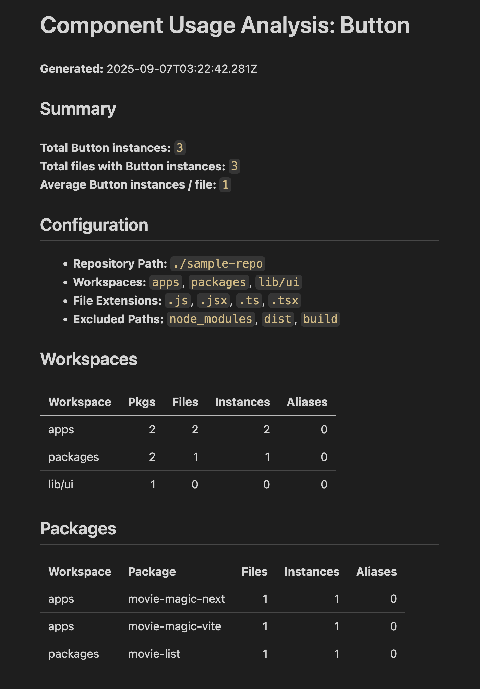

# Component Usage Analyzer (Compu)

Analyze and report UI component usage across your code repository. It is
optimized to answer the question "Where is component X used?"

Here's a sample report:



## Features

- **🔍 Comprehensive Component Search**: Find all instances of a specific
  component across your entire codebase
- **🏗️ Monorepo Support**: Designed to work with complex repository structures
  including multiple workspaces and packages
- **📊 Detailed Reporting**: Generate both JSON and Markdown reports with usage
  statistics and file locations
- **🎯 AST-Based Analysis**: Uses TypeScript Abstract Syntax Tree parsing for
  accurate component detection
- **⚡ Multi-Format Support**: Analyzes JavaScript, JSX, TypeScript, and TSX
  files
- **📈 Usage Statistics**: Provides summaries including total instances, files
  affected, and average usage per file
- **🚫 Smart Filtering**: Configurable exclusion of directories like
  `node_modules`, `dist`, and `build`
- **📋 Workspace Organization**: Groups results by workspace and package for
  easy navigation
- **🔧 Flexible Configuration**: JSON-based configuration for easy customization
  and reuse
- **💻 CLI Ready**: Simple command-line interface for integration into
  development workflows

## Concepts

Compu can be configured to support complex repository structures with packages
located in different directories. A typical monorepo structure is shown below:

```
repository/
├── apps/           # A workspace
│   ├── app-one/    # A package
│   │   └── src/
│   └── app-two/    # Another package
│       └── src/
└── packages/       # Another workspace
    ├── pkg-one/    # A package
    │   └── src/
    └── pkg-two/    # Another package
        └── src/
```

Here we have code located in several workspaces (`apps`, `packages`). Each
workspace has one or more packages underneath it.

Compu uses a configuration file to specify the repository structure. Here's the
configuration file for the above structure:

```json
{
  "repoPath": "/path/to/repo",
  "workspacePaths": ["apps", "packages"],
  "excludePaths": ["node_modules", "dist", "build"],
  "fileExtensions": [".js", ".jsx", ".ts", ".tsx"],
  "component": {
    "name": "Button",
    "moduleSpecifiers": ["@sample/ui", "**/Button"]
  },
  "jsonOutputPath": "./compu-results.json",
  "mdOutputPath": "./compu-results.md",
  "verbose": false
}
```

Here's an explanation of each configuration parameter:

- `repoPath`: Path to the git repository
- `workspacePaths`: Array of relative paths within the repository where packages
  can be found. Packages are the starting points to search for components.
- `excludePaths`: Array of paths to exclude from search, relative to each
  package
- `fileExtensions`: Array of file extensions to search
- `component.name`: Name of the component to search
- `component.moduleSpecifiers`: Modules from where component can be imported
- `jsonOutputPath`: Path to write the JSON output file
- `mdOutputPath`: Path to write the markdown output file
- `verbose`: Whether to write verbose output

## Getting Started

The easiest way to get started is to globally install Compu:

```shell
npm install -g component-usage-analyzer
```

Now open a shell and execute the following commands.

```shell
# Change directory to your repository's root
cd ~/projects/movie-magic

# Create a starter config file
compu --create-config

# This will create a starter config file called compu-config.json in your repo's root.
# Edit the config file to match your repo structure and the component you want to analyze.

# Execute compu - this assumes your configuration file is at ./compu-config.json
compu

# If your config file is called something else, execute with the --config option
compu --config=my-compu-config.json
```

This will generate the JSON and markdown output files specified in your
configuration file. Look at the markdown file to see the usage report for your
component. For a more granular report, look at the JSON file. That's all there
is to it. Enjoy!

## Prerequisites for development

1. Install [Node Version Manager](https://github.com/nvm-sh/nvm) (nvm). It
   allows using different versions of node via the command line
2. Run `nvm use` to use the required version of node.
3. Run `pnpm i` to install required packages.

## Development Build

```shell
pnpm dev
```

Application will rerun if you make code changes.

## Production Build

```shell
pnpm build

# Start using pnpm script
pnpm start

# Or start directly using node
node dist

# Or start using npx (this requires publishing the package to npm)
npx compu
```

## All Commands

```
pnpm build            # builds the prod bundle
pnpm clean            # deletes all build artifacts
pnpm dev              # runs the dev build
pnpm fix              # lints, formats and attempts to fix any issues (requires `pnpm build` has been ran)
pnpm lint             # runs the linter, useful for debugging lint issues (generally `pnpm fix` is preferred)
pnpm start            # runs the prod build
```
